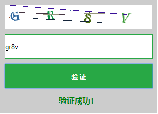

# php 动态验证码类
composer require 1352255400/phpgifcode

#获取验证码

require_once __DIR__ . '/../vendor/autoload.php';

use Code\Code;

#获取验证码

$width = '300';

$height = '50';

$font_size = '20';

echo Code::getCode($width, $height, $font_size);

#验证验证码

require_once __DIR__ . '/../vendor/autoload.php';

use Code\Code;

$code = isset($_GET['code']) ? $_GET['code'] : '';

if (!empty($code)) {

	$data = Code::checkCode($code);

	echo json_encode($data);die;

}

